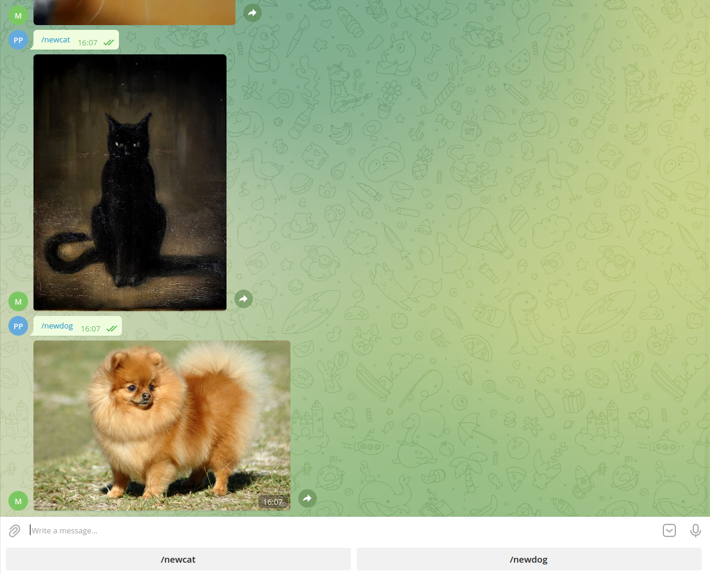

# tele_bot_muterobot
# Telegram Bot @MuteRobot

#####   Oтправляет картинку с котиком

_____
#####   Oтправляет картинку с котками или собачками.
_____
При старте 
>/start

даст приветствие + картинка. Далее даст варианты - новые каритнки котиков/пёселей

^_^

>/newcat

>/newdog

Картинки под рандомом с [котики](https://api.thecatapi.com/v1/images/search) / [пёсели](https://api.thedogapi.com/v1/images/search)
_____

